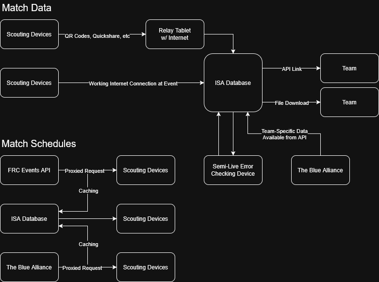

# 2026 Indiana Scouting Alliance App

This repository houses a React progressive web app serving as the offline-first scouting app custom designed for use by the Indiana Scouting Alliance in the 2026 FIRST Robotics Competition game, REBUILT.

## Development Instructions

See [CONTRIBUTE.md](CONTRIBUTE.md)

## App Architecture

### Data Flow

